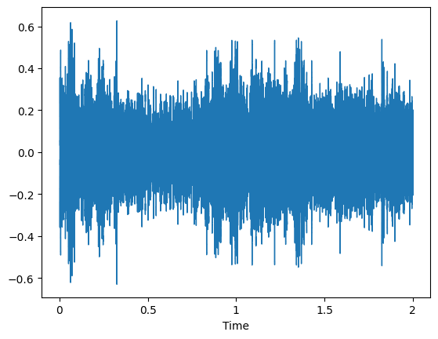
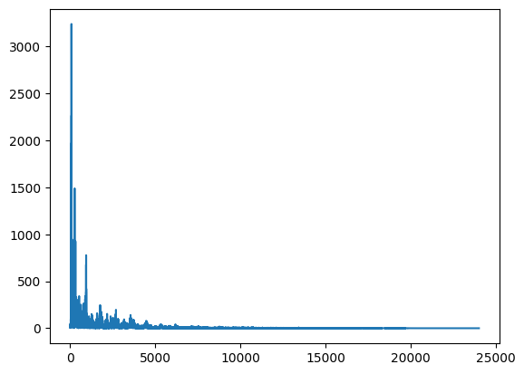
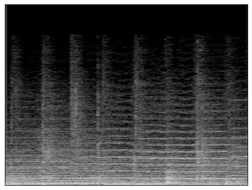

# Bass Separator

## About the Project
Oftentimes, when we listen to a song, we only hear the end product, or *the final mix*, so to speak. This mixture contains all the individual tracks (from vocals to the instruments) mixed and mastered into a single track. Now, a question arises: *how can we revert the process and get the individual sources back, given only the end product?* This area of study is otherwise known as **Blind Source Separation (BSS)**. 

The Bass Separator is a personal project I developed focusing on this area to extract the bass instrumental track from any song using **deep learning** and **Short-Time Fourier Transform (STFT)**. The program uses a convolutional neural network architecture called the U-Net developed by Ronneberger et al. (2015). The U-Net is typically used in image segmentation in biomedical applications to determine *what* features are in an image and even *where* they are in that image.

Based on Pourtorkan's (2022) idea, one can actually transform the BSS problem into an image segmentation problem by using spectrograms. Spectrograms are visualizations of sound waves that show *what* frequencies are present and *when* they are present in time. In other words, they represent sound waves in the time-frequency domain as opposed to the time domain only (which is what waveforms show us). Spectrograms can be generated through a method called Short-Time Fourier Transform (STFT), which takes the Fast Fourier Transform (FFT) of several windows throughout the input signal. Think of it as taking multiple 'snapshots' of the whole frequency range and corresponding power spectrum as the signal changes through time.

<p align="center">
  
</p>
<p align="center"><i>Waveform -- the visual representation of audio we're most familiar with</i></p>

<p align="center">
  
</p>
<p align="center"><i>Fourier Transform -- the 'snapshot' of the whole frequency range and their average magnitudes throughout the whole signal</i></p>

<p align="center">
  
</p>
<p align="center"><i>Spectrogram -- combinations of these 'snapshots' over several time windows throughout the signal, with the color representing the magnitude (similar to a heat map)</i></p>

The program essentially takes a path to a `.wav` file, splits it into several segments, computes the spectrograms of those segments, and passes those spectrograms to a pretrained model which predicts the bass track and the bassless track (the track without the bass stem) of the original song.

## Getting Started

### Installing Dependencies
Before you run the program, a few dependencies are needed which may be installed via `pip`:

```
!pip install musdb
!pip install numpy
!pip install "tensorflow<2.11"
!pip install librosa
!pip install matplotlib
```

### Running the Program
To extract the bass and bassless tracks of a `.wav` file, please do the following:
1. Open a terminal, and navigate to the project root directory.
2. Run `python3 bass_separator.py "PATH/TO/THE/SONG.wav"`
3. After execution, the predicted tracks should be available in the same directory as that of the original song, where `SONGNAME_bass.wav` and `SONGNAME_bassless.wav` indicate the bass and bassless tracks, respectively.

### Training a Model
As of *April 2, 2024*, I am still working on making it possible to train your own model. For now, only the bass extraction and filter is available. 

## References
- Bhattiprolu, S. (2023). python_for_microscopists [Github repository]. https://github.com/bnsreenu/python_for_microscopists
- Pourtorkan, M. (2022). *Audio source separation using deep learning* [Undergraduate thesis, University of London]. https://github.com/mohammadreza490/music-source-separation-using-Unets/blob/main/project%20report.pdf 
- Ronneberger, O., Fischer, P., & Brox, T. (2015). *U-Net: Convolutional networks for biomedical image segmentation* [Paper presentation]. Medical Image Computing and Computer-Assisted Intervention (MICCAI) 2015. http://dx.doi.org/10.1007/978-3-319-24574-4_28 

## Contributors 
* Rohan Solas
